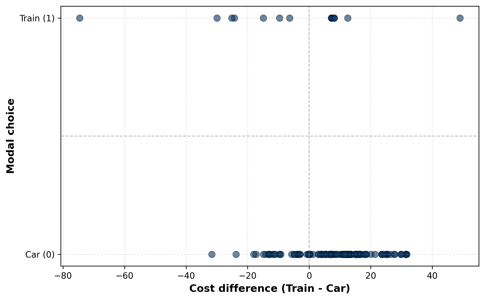
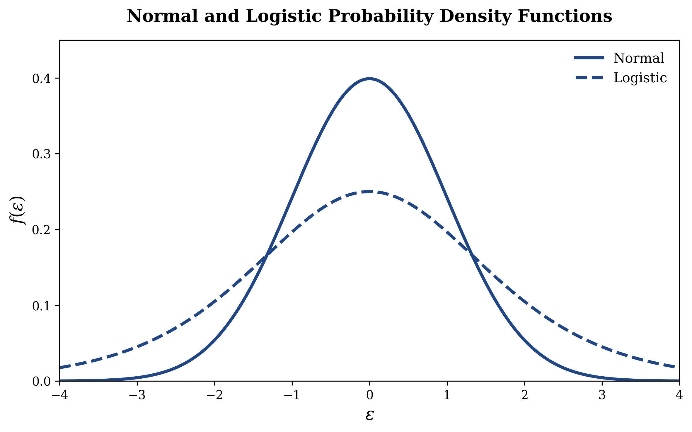

# Dichotomous choice modeling

## Introduction

In the early 1990s, researchers studying the Montreal-Toronto corridor—one of Canada's busiest intercity travel routes—wanted to understand how travelers actually choose between transportation modes. It's a practical question: if you know how people make these choices, you can forecast demand and predict what happens when prices or schedules change. The data come from the Canadian Travel Survey, conducted by Transport Canada (Canada's federal transportation department). Frank Koppelman and colleagues pulled intercity mode choice data from this survey, which captured real travel decisions along with the details that matter: ticket cost, how long the trip takes (both sitting in the vehicle and waiting around), how often service runs, and who's traveling (their income, trip distance, and so on).

The full dataset included 3,880 travelers across four modes, but our binary choice scenario is a better place to start learning the core ideas. We're going to focus on a smaller slice: 206 travelers who faced a straightforward choice between commuting by train or by car. Why this subset? Because when you're trying to understand the fundamentals of how people make choices, having only two options is cleaner. You can see the cost-versus-convenience trade-off without other alternatives muddying the picture.

Here are the data for a randomly-chosen subset of 10 commuters:

|   ID | Decision | Train cost | Car cost |
|-----:|:--------:|-----------:|---------:|
|    8 | car      |    $28.25  |  $15.77  |
|  282 | car      |    $34.80  |  $38.76  |
|  486 | car      |    $35.35  |  $19.76  |
|  502 | car      |    $45.40  |  $15.58  |
|  579 | train    |    $20.45  |  $12.35  |
| 2867 | car      |    $29.10  |  $12.54  |
| 2870 | car      |    $29.10  |  $12.54  |
| 2890 | car      |    $29.35  |  $10.83  |
| 3037 | train    |    $62.80  |  $69.16  |
| 4323 | car      |    $60.60  |  $61.37  |
: Sample of 10 commuter transportation choices {#tbl-commuter-choices}

Our goal in this chapter is to learn how to develop a causal model that helps make good predictions about commuters' choices. To do this, we start by making another simplifying assumption: that only *one* factor determines commuters' choices between two options. We will relax this assumption later in the chapter. For now, though, we assume that the only factor that determines these commuters' modal choice is the difference in cost of the two modes of commuting. @tbl-cost-difference shows the same data as @tbl-commuter-choices, except that it shows the difference in modal costs instead of the individual modal costs.

|   ID | Cost difference | Decision |
|-----:|----------------:|:--------:|
|    8 |          $12.48 | car      |
|  282 |          -$3.96 | car      |
|  486 |          $15.59 | car      |
|  502 |          $29.82 | car      |
|  579 |           $8.10 | train    |
| 2867 |          $16.56 | car      |
| 2870 |          $16.56 | car      |
| 2890 |          $18.52 | car      |
| 3037 |          -$6.36 | train    |
| 4323 |          -$0.77 | car      |
: Modal choice and cost difference (train - car) {#tbl-cost-difference}

Looking at this table, there seems to be no discernible pattern between modal choice and cost difference. However, @tbl-choice-by-cost, which uses data from all 206 commuters, shows a clearer result.

|                      | Train | Car   |
|---------------------:|------:|------:|
| Train costs more     |  6.0% | 94.0% |
| Train costs less     | 17.5% | 82.5% |
: Modal choice by cost difference sign {#tbl-choice-by-cost}

While only 6% of commuters choose to travel by train when the train costs more than driving, this proportion is almost three times as much when the train costs less than driving. This pattern can also be seen in @fig-modal-choice, where train choices (points at $Y=1$) tend to cluster on the left side of the plot where cost differences are negative, meaning the train is cheaper than driving.

{#fig-modal-choice}

We now turn to the task of modeling this relationship so we can better understand how the difference in costs influences the probability that an individual will choose to commute by train, which we use interchangeably with the word transit. But before we lay out the formal model, I want to bring you on a brief historical journey.

## A Problem of Transportation Planning

In the mid-1960s, traffic congestion in the Bay Area had reached a critical juncture. The California Highway Commission faced a fundamental decision: should they continue investing in freeway expansion, or could a new mass transit system offer a better path forward? They proposed an ambitious solution—a network of buses and rail that would connect the region, fundamentally reshaping how people commuted. But there was a problem. Before committing billions in public resources, the Commission needed to answer a deceptively simple question: 

**How many people would actually use this system?**

In 1969, with the first BART station under construction, the Commission faced a pilot phase evaluation. They needed to estimate ridership—not based on hunches or optimistic projections, but on actual data about people's choices. So they conducted an extensive survey of Bay Area residents, asking a seemingly straightforward question: 

**Would you take the bus instead of driving? Yes or no?**

This binary question—a dichotomous choice—would unlock something far more significant than transit planning. It would lead to the discovery of a new statistical framework that would transform how economists, marketers, and policymakers understand decision-making itself.

## The Birth of a Framework: Dan McFadden's Insight

The Commission's first instinct was to use standard regression—treating the yes/no responses as if they were continuous measurements. Using this linear probability model, they estimated that about 15% of Bay Area residents would use the new transit system.

But then they hired a young economist named Daniel McFadden, who recently arrived at Berkeley. McFadden looked at the problem differently. He recognized something fundamental: when people make discrete choices—yes or no, use transit or drive, buy or don't buy—the standard tools of regression analysis were fundamentally mismatched to the problem.

McFadden developed a new approach using what he called latent variable modeling. The insight was elegant: behind every observed choice lies an unobserved psychological disposition. When someone decides whether to take the train, they're processing information about commute time, cost, convenience, and comfort—all of which feed into a latent evaluation of the option. When that latent evaluation exceeds some threshold, they choose to use transit.

Using this framework, McFadden predicted that only about 6.3% of residents would use BART. His colleagues dismissed this as too pessimistic. Yet when BART opened and ridership was measured, it came in at 6.2%—remarkably close to McFadden's prediction.

This work on discrete choice modeling was so significant that in 2000—more than three decades later—McFadden was awarded the Nobel Prize in Economics. The Nobel citation recognized his contribution: "He showed how to statistically handle fundamental aspects of microdata, namely data on the most important decisions we make in life: the choice of education, occupation, place of residence, marital status, number of children, so called discrete choices."

Today, the methods McFadden pioneered are used everywhere: predicting consumer behavior, understanding labor market decisions, analyzing election outcomes, and evaluating policy interventions.

So let's get on with our task. We will build a model that answers the following question: if the commute cost by transit could be reduced, by how much would the probability that someone will choose transit increase?

## The Model

To begin, let's establish some basic foundations. When people make dichotomous decisions (i.e. one that involves picking one of two options), we can describe the outcome using the **Bernoulli distribution**.

::: {.callout-important icon=false}
## Definition

For a dichotomous outcome $Y$ that takes the value 1 with probability $p$ and the value 0 with probability $(1-p)$, the probability function is:

$$f(Y) = p^Y(1-p)^{1-Y}$$
:::

In our commuting example, $Y_i = 1$ represents the $i^{\text{th}}$ commuter's decision to choose transit  and $Y_i = 0$ represents their decision to drive to work. The probability $p_i$ represents the probability that the $i^{\text{th}}$ commuter will choose transit, given their specific circumstances. At times, I will be suppressing the subscript $i$ from the notation for expositional ease but you should remember that this subscript is lurking in the equations that follow. 

Following standard econometric practice, we can decompose the observed outcome, $Y$, into a deterministic part, $\hat{Y}$, and a random error term, $\epsilon$:
$$ Y = \hat{Y} + \epsilon $$ {#eq-universal}

Our prediction $\hat{Y}$ is the expected value of $Y$, which minimizes the expected squared prediction error. For a binary outcome where $Y \in \{0,1\}$, the expected value is simply the probability that $Y=1$:
$$\hat{Y} = E(Y) = (1-p) \times 0 + p \times 1 = p$$

Therefore:
$$Y = p + \epsilon$$ {#eq-dcm}
where $p$ is the predicted probability and $\epsilon$ is the error term.

Our next key question is: **how does the difference in commute costs, which we will abbreviate as $\text{Diff}$, relate to $p$?**

## The Linear Probability Model: A First Attempt

The most straightforward approach is the **Linear Probability Model (LPM)**, which assumes a linear relationship between the difference in commuting costs and the probability of choosing transit:

$$p = \beta_0 + \beta_1 \text{Diff}$$ {#eq-lpm}

Combining equations [-@eq-dcm] and [-@eq-lpm], we get

$$Y = \beta_0 + \beta_1 \text{Diff} + \epsilon$$ {#eq-lpm-model}

The coefficients of the LPM can be estimated using OLS:

| Variable    | Coefficient | *p*-value |
|-------------|------------:|----------:|
| Intercept   |      0.1283 |    <0.001 |
| Diff        |      0.0054 |    <0.001 |

: Linear Probability Model Results {#tbl-lpm-estimates}

These results can also be expressed in the form of the estimated equation:

$$
\begin{aligned}
\hat{Y} &= 0.1283 + 0.0054 \text{ Diff} \\
&\phantom{...} (0.001) \phantom{>.} (0.001)
\end{aligned}
$$

The $\text{R}^2$ of this model is 0.072, which implies that the difference in commuting costs explains only about 7\% of the variation in commuting choice. This is not at all surprising since commuters account for many other variables, all of which we're ignoring in this simple model.

How do we interpret the estimated coefficients presented here? 

First, the estimated intercept equals 0.1283. Remember, if the commuting cost is the same for a specific person, their value of $\text{Diff}$ equals 0. For such commuters, the estimated model simplifies to 

$$\hat{Y} = 0.1283\text{.}$$

Since $p = \hat{Y}$, this implies there is a 13% chance that such a commuter will take the train to work.

Now let's interpret the coefficient of $\text{Diff}$. Partially differentiating equation [-@eq-lpm-model] with respect to $\text{Diff}$,

$$\frac{\partial \hat{Y}}{\partial  \text{Diff}} = \beta_1 + \frac{\partial \epsilon}{\partial  \text{Diff}}\text{.}$$

Making the usual assumption that the random error term $\epsilon$ is uncorrelated with the differences in cost of commuting, $\frac{\partial \epsilon}{\partial  \text{Diff}} = 0\text{.}$ Thus, the estimated coefficient $\hat{\beta}_1$ represents the change in probability for a \$1 change in the difference in commuting costs. 

Our results show that for each \$1 increase in cost difference (car becomes more expensive relative to train), the probability of choosing train increases by 0.54 percentage points. Equivalently, a $10 subsidy on train fare increases the chance of individuals commuting by train by 5.4 percentage points.

### Problems with LPM

The LPM simply ignores the fact that the variable takes on only 2 values, 0 and 1. Further, it imposes a linear relationship between $\text{Diff}$ and $Y$. This implies that every additional dollar in cost difference leads to the same change in the commuters' probability of taking the train, which is not very realistic. Second, because the LPM is linear, it is also unbounded. This means that it can theoretically predict values of $Y$ less than 0 and greater than 1, which makes little sense. Finally, the LPM suffers from heteroskedasticity (see proof in Appendix).

There are two possible methods to overcome the deficiencies of the LPM. One possibility is to use a non-linear model, and estimate it using **non-linear least squares**. The second, easier approach is to use **latent variable models**, which is what we now turn to.

## Latent Variable Models

In this class of models, we make the (realistic) assumption that the decision of a commuter, $Y$, depends on some latent (unobserved) variable $\tilde{Y}$. In our commuting example, $\tilde{Y}$ represents each commuter's underlying propensity or utility for choosing train over car—a measure of how much they favor train travel that exists in their mind but isn't directly observable to us. This latent variable is influenced by factors like cost differences, travel time, and personal preferences, and it can take any value along a continuous scale. 

We only observe the final binary decision $Y$: when $\tilde{Y}$ is positive (favoring train), the commuter chooses train ($Y = 1$), and when $\tilde{Y}$ is negative or zero (favoring car), they choose car ($Y = 0$). Formally, we are postulating that the decision variable $Y$ and the latent variable $\tilde{Y}$ are linked via the following **indicator function**:

$$Y = \begin{cases} 1 & \text{if } \tilde{Y} > 0\\ 0 & \text{if } \tilde{Y} \leq 0\end{cases}$${#eq-y2lv}

It follows from equation [-@eq-y2lv] that
$$\text{Pr}(Y = 1) = \text{Pr}(\tilde{Y} > 0) \text{.}$$ {#eq-plv2px}

Further, we assume that the latent variable $\tilde{Y}$ depends on observable factors through a linear relationship. While many factors influence a commuter's choice between train and car—such as travel time, comfort, reliability, and personal preferences—in our simplified story we will focus on just one: the difference in cost between the two modes. This simplification allows us to write
$$\tilde{Y} = \beta_0 + \beta_1 \text{Diff} + \epsilon \text{,}$$ {#eq-lv2x}

which implies 

$$
\begin{align}
\text{Pr}(\tilde{Y} > 0) &= \text{Pr}(\beta_0 + \beta_1 \text{Diff} + \epsilon > 0) \\
&= \text{Pr}(\epsilon > -\beta_0 - \beta_1 \text{Diff}) \text{.}
\end{align}
$$ {#eq-plv2px2}

Combining equation [-@eq-plv2px] with equation [-@eq-plv2px2], we have

$$
\begin{align}
\text{Pr}(Y = 1) &= \text{Pr}(\epsilon > - \beta_0 - \beta_1 \text{Diff}) \\
&= 1 - F(-  \beta_0 - \beta_1 \text{Diff}) \\
&= 1 - F(- \hat{\tilde{Y}}) \text{,}
\end{align}
$$ {#eq-almost-there}

where $\hat{\tilde{Y}} = \beta_0 + \beta_1 \text{Diff}$ is the non-random part of the latent variable $\tilde{Y}$, and $F$ is the distribution function of $\epsilon$, it's random part.

We now make two additional assumptions. The first is very standard, that the expected value of $\epsilon$ is zero. The second one is harder to swallow: we assume that the density function of the random variable $\epsilon$ is symmetric around the mean. With these under our belt, we can assert that

$$F(\hat{\tilde{Y}}) = 1 - F(-\hat{\tilde{Y}}) \text{.}$$ {#eq-prepenultimate}

Finally, we can combine equations [-@eq-almost-there] with [-@eq-prepenultimate] to write

$$
\begin{align}
\text{Pr}(Y = 1) &= F(\hat{\tilde{Y}}) \\
&=  F(\beta_0 + \beta_1 \text{Diff}) \text{.}
\end{align}
$$ {#eq-penultimate}

Whew! That was a ton of mathy gymnastics but we're home, finally! Given the assumption that the model has been correctly specified and that the random part of individuals' decision making process has symmetric distribution, we are able to assert that
$$ \text{Pr}(Y = 1) = F(\beta_0 + \beta_1 \text{Diff}) \text{.} $$ {#eq-final-lvm}

We are now in a position to employ any distribution function $F$ whose density function has zero mean and is symmetric. This is exactly what the probit and logit specifications do, each using a distinct distribution function with these properties, as shown in figure [-@fig-logit-probit-densities].

{#fig-logit-probit-densities}

We now turn to the analytical expressions of these densities.

### The Probit Model

The probit model assumes that the function $F(.)$ can be approximated by the distribution function of the standard normal variable, where

$$
\begin{align}
F(\epsilon) &= \int_{-\infty}^{\epsilon} \frac{1}{\sigma \sqrt{2\pi}} \exp\left(-\frac{x^2}{2\sigma^2}\right) dx \\
&= \Phi(\epsilon)
\end{align}
$$

In the context of our example, therefore, the probit version of the latent variable model asserts

$$p = \text{Pr}(Y = 1) = \Phi(\beta_0 + \beta_1 \text{Diff}) \text{.}$$
To estimate the marginal effect of the difference in commuting costs, $\text{Diff}$, on the probability $p$ that a commuter will take the train to work, we need to partially differentiate $p$ with respect to $\text{Diff}$:

$$
\begin{align}
\frac{\partial p}{\partial \text{Diff}} &= \frac{\partial \Phi}{\partial \text{Diff}} \\
&= \beta_1 \, \, \phi(\beta_0 + \beta_1\text{Diff})
\end{align} \text{,}
$$

where $\phi$ is the standard normal density.

### The Logit Model

The logit assumption is

$$F(\epsilon) = \frac{e^\epsilon}{1 + e^\epsilon} = \frac{1}{1 + e^{-\epsilon}}$$

In our example, this translates into

$$p = \text{Pr}(Y = 1) = \frac{e^{( \beta_0 + \beta_1 \text{Diff})}}{1+e^{( \beta_0 + \beta_1 \text{Diff} )}}$$ {#eq-logit-p}

The expression above yields the probability that a commuter will take the train to commute. We can use it estimate the probability that a commuter will *not* take the train to commute:

$$\begin{align}
1 - p = \text{Pr}(Y = 0) &= 1 - \frac{e^{( \beta_0 + \beta_1 \text{Diff} )}}{1+e^{( \beta_0 + \beta_1 \text{Diff} )}} \\
&= \frac{1}{1+e^{( \beta_0 + \beta_1 \text{Diff} )}}
\end{align}
$$ {#eq-logit-q}

Taking the ratio of equations [-@eq-logit-p] and [-@eq-logit-q], we get

$$
\begin{align}
\frac{p}{1-p} &= \frac{\text{Pr}(Y = 1)}{\text{Pr}(Y = 0)} \\
&= e^{( \beta_0 + \beta_1 \text{Diff})}
\end{align}
$$

Taking logs on both sides, we get

$$\log \left( \frac{p}{1-p} \right)= \beta_0 + \beta_1 \text{Diff,}$$

which simply states that the log of the odds that a commuter will take the train is a linear function of the difference in commuting costs. Differentiating $p$ with respect to $\text{Diff}$ yields

$$\frac{\partial p}{\partial \text{Diff}} = \beta_1 p(1-p) \text{.}$$

This is the key result for logit: the marginal effect equals the coefficient times p times (1-p).

You can also write it in the expanded form:

$$\frac{\partial p}{\partial \text{Diff}} = \beta_1 \frac{e^{\beta_0 + \beta_1 \text{Diff}}}{(1 + e^{\beta_0 + \beta_1 \text{Diff}})^2}$$

The first form is cleaner and shows that the marginal effect depends on the probability level p.

### Comparison of Probit & Logit

Probit and logit yield coefficients and marginal effects that are very similar, though not identical. So which of these methods should one employ? Probit and logit models yield very similar results in practice, with coefficients and marginal effects that are close but not identical. The choice between them often comes down to context and convention rather than statistical superiority.

From a technical standpoint, probit models have an advantage when dealing with heteroskedasticity (unequal error variances across observations). The probit framework can be more easily extended to account for varying error variances, making it preferred when this is a concern. Additionally, probit models have a natural connection to utility maximization theory in economics, since they arise from assuming normally distributed errors in the utility function. 

Another key difference is interpretability: in the logit model, the coefficients can be directly interpreted in terms of odds ratios, which makes them particularly attractive in fields like epidemiology and biostatistics where odds ratios are a natural way to communicate risk. For example, exponentiating the coefficient `$\beta_1$` gives the multiplicative change in the odds of choosing train for each one-unit increase in the cost difference. This interpretation has no equivalent in the probit model.

However, for most practical applications where heteroskedasticity is not a major issue and odds ratios are not the primary focus, the choice between probit and logit is largely a matter of researcher preference and disciplinary convention. Both models will generally lead to similar substantive conclusions about which variables matter and how they affect choice probabilities.

## The Likelihood Function

The expressions in @eq-probit-p and @eq-logit-marginal describe the probability that a given agent will choose $y=1$ for the probit and the logit models respectively. However, the sample contains several agents, some of whom choose $y=0$. Using these expressions, *assuming that each agent is making his or her choice independently*, we can write the **joint likelihood function** of observing the sample.

$$\mathcal{L} = \prod [p | y=1] \times \prod [(1-p) | y = 0]$$

These assume the form

$$\mathcal{L} = \prod (\Phi(\beta_0 + \beta_1 x_1 + \cdots + \beta_n x_n | y = 1) \times \prod ([ 1- \Phi(\beta_0 + \beta_1 x_1 + \cdots + \beta_n x_n) ] | y = 0)$$

and

$$\mathcal{L} = \prod \left( \frac{e^{( \beta_0 + \beta_1 x_1 + \cdots + \beta_n x_n )}}{1+e^{( \beta_0 + \beta_1 x_1 + \cdots + \beta_n x_n )}} | y =1 \right) \times \prod \left( \frac{1}{1+e^{( \beta_0 + \beta_1 x_1 + \cdots + \beta_n x_n )}} | y = 0 \right)$$

for probit and logit respectively.

### The Maximum Likelihood Estimator (MLE)

Suppose you are told that President George W. Bush had proposed a new initiative called The Frolicking Fisheries, which he claimed would restore the ecosystem health of all fisheries in the United States. If you had to guess whether this new initiative would actually cause harm to the fisheries, what would you think? While one's prediction can turn out to be false, given the President's environmental record many would guess that his proposed initiative would actually harm fisheries. The guesser knows that her guess *could* be incorrect, but she will attempt to choose the option that is more likely to be right than wrong. This is the central idea underlying the **maximum likelihood estimator (MLE)**: given a dataset and a regression model, choose those values of the coefficients that maximize the likelihood of being consistent with the data. In other words, we wish to maximize the value of the likelihood function by appropriately choosing the $\beta$s.[^mle-log] Let us now apply this idea to voting behavior data at hand.

[^mle-log]: In practice, the models are estimated by maximizing the log of $\mathcal{L}$, which is equivalent to maximizing $\mathcal{L}$ since the logarithmic function is strictly positive and monotonic.

## Probit Estimation

In the probit model, we postulate that

$$\text{VOTE}_i = \Phi ( \beta_0 + \beta_1 \text{CONTRIB}_i )$$

where $\Phi$ is the cumulative distribution function of the standard normal density.[^probit-theory] Our task is to make the best guess about $\beta_0$ and $\beta_1$, given our dataset. While you will never need to follow the recipe I outline below (the software does it for you), it's a good idea for you to understand the mechanics of how these estimates are arrived at.

[^probit-theory]: To understand the theory underlying this specification, see Appendix.

1. The software starts with a random initial guess about the values of the $\beta$s. Suppose that it guesses $\beta_0 = -2$ and $\beta_1 = 1.5 \times 10^{-4}$

2. For each legislator, the software then computes the value in the parenthesis. Thus, for example, this value is -1.025 for the $67^{\text{th}}$ legislator, who received a contribution of \$6,500. Likewise, it is 4.855 for the $459^{\text{th}}$ legislator, who received a contribution of \$45,700. Call this the $z$-score of each legislator.

3. Using the $z$-score of each legislator, the software computes the area under the standard normal curve from $-\infty$ to the corresponding $z$-score for each legislator. This value is 0.152681593833111 for the $67^{\text{th}}$ legislator, and 0.99999939806622 for the $459^{\text{th}}$ legislator. These numbers represent our guesses that, given the amounts of contribution they received, these legislators would vote YES.

4. Next, the software computes the probability that each legislator would vote the way he or she actually did. In other words, since we know from our data that the $67^{\text{th}}$ legislator voted NO and the $459^{\text{th}}$ one voted YES, the software calculates these from the above step. Since we know the probabilities of each legislator's YES vote, this is a simple matter. The probability that the $67^{\text{th}}$ legislator will vote NO is 0.847318406166889 (1 - 0.152681593833111). For the $459^{\text{th}}$ legislator, we already have the answer: 0.99999939806622. We now have the probability of observing each legislator's actual behavior, conditional on our initial guess.

5. Assuming that each legislator voted independently (possibly a tricky assumption in this case!), it multiplies each of the individual legislator's probabilities to compute the **joint likelihood of observing the sample**. For our dataset, and given our guess, this number is $1.2156 \times 10^{-154}$. Since this number is hard to fathom, we can take its natural log, which is -354.40. This is typically the number that software programs report, and is called the log likelihood.[^log-likelihood]

6. The calculated joint likelihood (or log likelihood) is contingent on our initial guess of $\beta_0$ and $\beta_1$. Using sophisticated algorithms, the software then makes another guess to increase the joint likelihood and repeats all the steps above. When it finds that it has maximized the joint likelihood, it stops iterating, and outputs the result. The final estimates of $\beta_0$ and $\beta_1$ can be represented by $\hat{\beta}_0$ and $\hat{\beta}_1$.

[^log-likelihood]: Since the log function is monotonically increasing, maximizing a quantity and maximizing its log value are equivalent. For computational reasons, it is easier to maximize the log likelihood function rather than the likelihood function directly.

### Results

The MLE results for the given dataset are shown in @tbl-probit-results. Our probit results also show that campaign contributions significantly affect the voting behavior of legislators.

| Variable  | Coefficient | *p*-Value |
|-----------|------------:|----------:|
| CONTRIB   |   0.0001247 |     0.000 |
| Intercept |  -3.127849  |     0.000 |

: MLE Estimation Using Probit {#tbl-probit-results}

{#fig-fitted-model}

#### Threshold Contribution

To calculate the threshold level of contribution that would make a legislator vote YES, we find the level of contribution where $\hat{\beta}_0 + \hat{\beta}_1 \times \widetilde{\text{CONTRIB}} = 0$ (why?). Solving this equation, we find that $\widetilde{\text{CONTRIB}} = \$25,082.99$. Again, this is quite different from the LPM result, and seems more reasonable for this dataset.

#### Marginal Effects

To calculate the marginal effect of contribution on voting behavior, we turn to our estimated model.

$$\widehat{\text{VOTE}}_i = \Phi ( \hat{\beta}_0 + \hat{\beta}_1 \times \text{CONTRIB}_i )$$

Taking the derivative of $\widehat{\text{VOTE}}$ with respect to $\text{CONTRIB}$, we get

$$\frac{d \widehat{\text{VOTE}}_i}{d \text{CONTRIB}} = \phi ( \hat{\beta}_0 + \hat{\beta}_1 \times \text{CONTRIB}_i ) \times \hat{\beta}_1$$

where $\phi$ is the standard normal density. The probit model implies that the effect of campaign contributions is *not* constant, but that it varies by level of contribution. For example, an increase in contribution by \$1 for a legislator receiving \$10,000 is

$$
\begin{align}
\frac{d \widehat{\text{VOTE}}_i}{d \text{CONTRIB}} &= 0.0001247 \times \phi ( -3.127849 + 0.0001247 \times 10,000 ) \\
&= 0.0001247 \times \phi ( -1.880849 ) \\
&= 0.0001247 \times 0.0680348630275953 \\
&= 8.48394741954113 \times 10^{-6}
\end{align}
$$

This estimate is about a third of the corresponding estimate of the LPM.

## Extensions

The ideas outlined above can be generalized to more than two discrete choices via the use of **multinomial models**. Another important extension applies to situations where the data is **censored**, for which the **Tobit model** is used.
